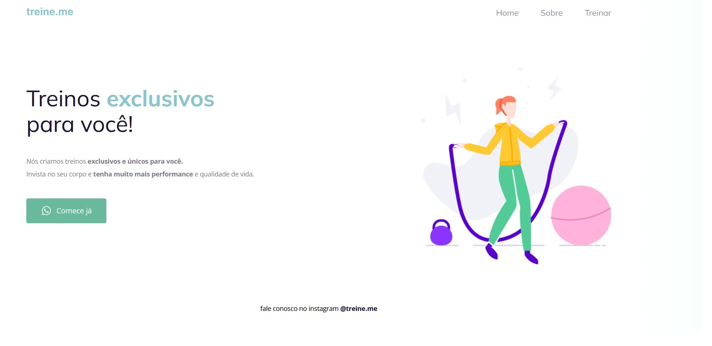

# Stage 02 - Introdução ao HTML e CSS

 Módulo que aboreda conceitos básicos de HTML e CSS. Projetos do Módulo:

# Desafio Acessibilidade

# Desafio Corrigindo Bugs

# Desafio Corrigindo Bugs 2

# Desafio Recriando Layout do Figma
